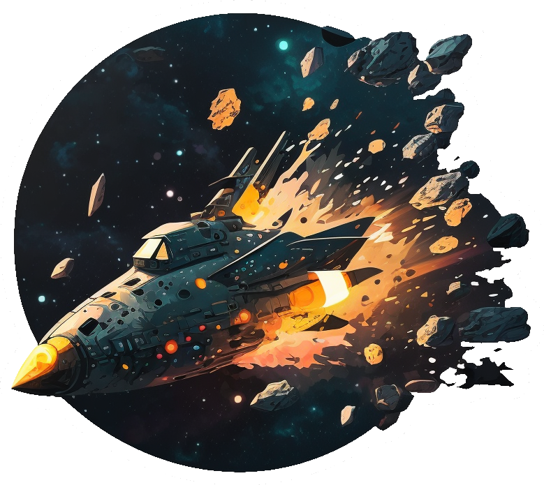

# Asteracer
A TAS-focused space racing game.

Compete for the fastest time to collect all checkpoints while avoiding the asteroids on a wide variety of maps.

## Getting started
To play Asteracer interactively, you can do so [on this website](TODO) (TODO).

For starting out with writing solves, see `src/example.py`.

## Contents
- `src/` – source code of Asteracer's implementations
  - `py/` – Python implementation
    - `asteracer.py` – the implementation
    - `example.py` – simple solution for the test map
    - `solver.py` – useful utilities for solving Asteracer
    - `test.py` – scripts for testing against this implementation
    - `__main__.py` – a PyQt5 visualizer (_under construction_)
    - `generator.py` – Asteracer's map generator
  - `cpp/` – C++ implementation (used in Webassembly)
    - `sim.cpp` – the implementation
- `maps/` – official maps (in `txt` and `svg` form)
- `graphs/` – graphs of maps for use in solving Asteracer

## Maps
There are currently two official maps Asteracer can be played on.

| Test                             | Sprint                             | Marathon                               |
| --- | --- | --- |
| |  |  | 
| _Test map._ | _Smaller, one goal._ | _Larger, multiple goals._ | 

## Game Specification
If you wish to implement Asteracer using a different language (which you're very welcome to do), refer to `SPECIFICATION.md`, which covers the design and specification of Asteracer in great detail.
Feel free to create an issue/let me know so I can a link to it here!
